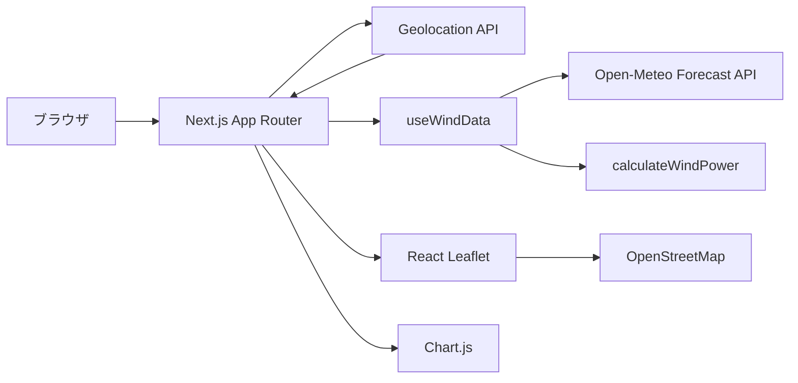

# 風力発電量シミュレーター 設計書

## 1. システム構成



## 2. 採用技術と理由

| 技術 | 採用理由 |
|---|---|
| Next.js 15 App Router | Vercel との親和性が高く、ルーティング、メタデータ、将来の API Route 拡張を一つの構成で管理できるため |
| TypeScript | 座標、気象レスポンス、計算結果の契約を型で表現し、項目名の誤りを早期検出できるため |
| React Hooks | 位置情報と気象データの取得ライフサイクルを UI から分離できるため |
| Open-Meteo | API キー不要、無料利用可能、現在値と時間別予測を同一 API で取得でき、今回の用途に必要な風速項目が明確なため |
| Geolocation API | OS やブラウザ標準の権限 UI を利用でき、外部位置情報 SDK に依存せず現在地を取得できるため |
| React Leaflet | OpenStreetMap を React の状態と自然に接続でき、地図操作やマーカーを自前実装せずに済むため |
| Chart.js | 時系列データ、ツールチップ、レスポンシブ描画が成熟しており、発電量グラフを短い実装で提供できるため |
| Tailwind CSS 4 | Next.js の初期構成と統合しやすく、レスポンシブな画面を保守しやすいため |
| Vercel | Next.js のビルドと配信、HTTPS、PWA 利用に適しており、API キー不要の構成では環境変数管理も最小限で済むため |

## 3. ディレクトリ設計

```text
app/
  page.tsx                 画面、状態の組み立て、テーマ切替
  layout.tsx               metadata、manifest、アイコン
  globals.css              デザイン、レスポンシブ、Leaflet 補助スタイル
components/
  WindMap.tsx              OpenStreetMap と現在地マーカー
  PowerChart.tsx           24 時間発電量の折れ線グラフ
hooks/
  useGeolocation.ts        現在地取得と状態管理
  useWindData.ts           Open-Meteo 通信とレスポンス変換
lib/
  calculateWindPower.ts    発電量の純粋計算
public/
  manifest.webmanifest     PWA メタデータ
  sw.js                    アプリシェルキャッシュ
  icon.svg                 PWA アイコン
 types/
  wind.ts                  座標・風況データ型
```

## 4. データフロー

1. `useGeolocation` が初回表示後に位置情報を要求する。
2. 成功時に `Coordinates` を生成し、画面と `useWindData` に渡す。
3. `useWindData` が座標をクエリパラメータへ変換して Open-Meteo を呼び出す。
4. レスポンスから現在風速と 24 個の時間別データへ正規化する。
5. `calculateWindPower` が現在風速とローター直径から表示用数値を計算する。
6. `PowerChart` は時間別風速を同じ式で kW に変換して描画する。
7. 座標は `WindMap` に渡され、地図中心とピン位置になる。

## 5. 状態設計

| 状態 | 所有箇所 | 内容 |
|---|---|---|
| `coordinates` | `useGeolocation` | 現在地または null |
| `locationLoading` | `useGeolocation` | 位置情報取得中か |
| `locationError` | `useGeolocation` | 位置情報エラー文言 |
| `windData` | `useWindData` | 現在風速と時間別風速 |
| `windLoading` | `useWindData` | API 通信中か |
| `windError` | `useWindData` | API エラー文言 |
| `rotorDiameter` | `page.tsx` | 1 から 10 m の入力値 |
| `darkMode` | `page.tsx` | テーマ切替状態 |

## 6. エラー設計

- 位置情報 API 非対応: 対応ブラウザではない旨を表示する。
- 権限拒否: ブラウザ設定で許可が必要である旨を表示する。
- タイムアウト・取得失敗: 再試行操作を表示する。
- Open-Meteo の HTTP エラー: 通信状況の確認を促す。
- 必須レスポンス不足: データなしとして扱い、壊れたグラフを表示しない。
- 途中で座標が変わった場合: `AbortController` で前回リクエストを停止する。

## 7. セキュリティ・プライバシー

- 座標はブラウザから Open-Meteo へ直接送信する。自前サーバーには保存しない。
- API キーを使用しないため、クライアントコードへの秘密情報埋め込みがない。
- 本番利用時は HTTPS を必須とする。
- 位置情報利用の許可・拒否はブラウザの標準 UI に委ねる。
- 将来、利用履歴や認証を追加する場合はサーバー側 API Route または外部バックエンドを導入し、保存目的と保持期間を明示する。
